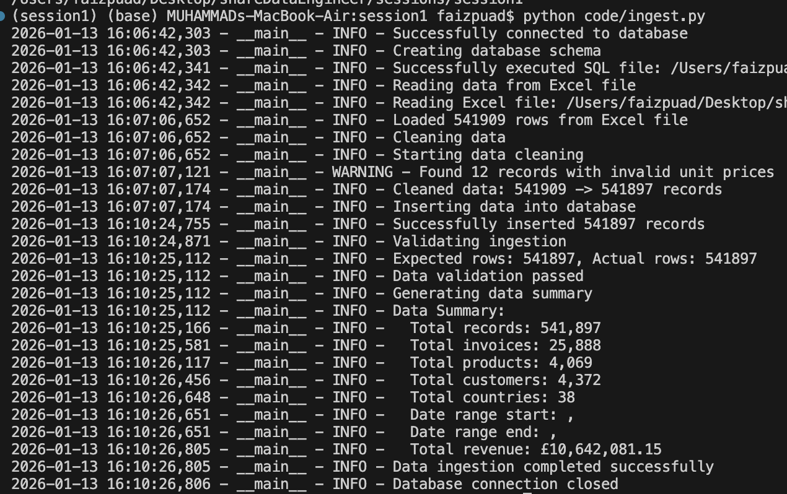

# Session 1: Data Ingestion & Foundations

## Overview

Session 1 introduces the fundamental concepts of data engineering by building a batch pipeline that ingests raw data from an Excel file into a PostgreSQL database. You'll learn about the data engineering mental model, batch vs streaming processing, and why SQL and Python are essential tools.

## Prerequisites

- Python 3.11 or higher
- PostgreSQL 15 or higher
- Docker and Docker Compose (optional but recommended)
- Data file: `data/online_retail.xlsx`

## Learning Objectives

- Understand the data engineering mental model: ingest → buffer → process → store → serve
- Differentiate between batch and streaming processing
- Learn why SQL and Python are critical for data engineering
- Build a working batch pipeline to ingest raw data
- Implement basic data cleaning and validation
- Load data into PostgreSQL database

## Setup

### Option 1: Using uv (Recommended)

```bash

# install uv
pip install uv

cd sessions/session1
uv venv
source .venv/bin/activate
uv pip install -r requirement.txt
```

### Option 2: Using pip

```bash
cd sessions/session1
python -m venv .venv
source .venv/bin/activate
pip install -r requirement.txt
```

### Option 3: Using Docker Compose

```bash
cd sessions/session1
docker-compose up -d postgres
```

## Environment Variables

Create a `.env` file in the session1 directory:

```bash
DB_HOST=localhost
DB_PORT=5432
DB_NAME=retail_db
DB_USER=postgres
DB_PASSWORD=postgres
```

Or use the provided example:

```bash
cp .env.example .env
```

## Run Instructions

### Step 1: Verify Data File

Ensure the data file exists:

```bash
ls -la ../../data/online_retail.xlsx
```

### Step 2: Start PostgreSQL (if using Docker)

```bash
cd sessions/session1
docker-compose up -d postgres
```

### Step 3: Run Ingestion

#### Using Python

```bash
cd sessions/session1
source .venv/bin/activate
python code/ingest.py
```

#### Using Docker

```bash
cd sessions/session1
docker-compose up ingest
```

### Step 4: Run Tests

#### Using pytest

```bash
cd sessions/session1
source .venv/bin/activate
pytest tests/ -v --cov=code --cov-report=html
```

#### Using Docker

```bash
cd sessions/session1
docker-compose run ingest python -m pytest tests/ -v --cov=code --cov-report=html
```

#### Expected Output


### Step 5: Verify Data

Connect to PostgreSQL and verify the data:

```bash
psql -h localhost -U postgres -d retail_db

# List tables in bronze schema
\dt bronze.*

# View sample data
SELECT * FROM bronze.raw_transactions LIMIT 10;

# Check data summary
SELECT 
    COUNT(*) as total_records,
    COUNT(DISTINCT invoiceno) as unique_invoices,
    COUNT(DISTINCT stockcode) as unique_products,
    COUNT(DISTINCT customerid) as unique_customers,
    MIN(invoicedate) as first_transaction,
    MAX(invoicedate) as last_transaction
FROM bronze.raw_transactions;

# Check revenue
SELECT SUM(quantity * unitprice) as total_revenue
FROM bronze.raw_transactions
WHERE quantity > 0;
```

## File Structure

```
sessions/session1/
├── requirement.txt           # Python dependencies
├── code/
│   ├── schema.sql            # Database schema for raw_transactions table
│   └── ingest.py             # Python ingestion script
├── tests/
│   ├── __init__.py
│   └── test_ingest.py        # Pytest test cases
├── docker/
│   └── Dockerfile           # Docker image definition
├── docker-compose.yml        # Docker Compose configuration
├── Notes.md                  # Theoretical concepts (pipeline mental model, batch vs streaming)
├── README.md                 # This file
└── .env.example              # Environment template
```

## Data Schema

### raw_transactions Table

| Column | Type | Description |
|--------|------|-------------|
| id | SERIAL | Primary key (auto-increment) |
| invoiceno | VARCHAR(10) | Invoice number (starts with 'c' for cancellations) |
| stockcode | VARCHAR(20) | Product code |
| description | VARCHAR(255) | Product description |
| quantity | INTEGER | Quantity per transaction |
| invoicedate | TIMESTAMP | Invoice date and time |
| unitprice | DECIMAL(10,2) | Unit price in sterling |
| customerid | VARCHAR(10) | Customer ID |
| country | VARCHAR(100) | Country name |
| ingested_at | TIMESTAMP | Timestamp when record was loaded |
| source_file | VARCHAR(255) | Source file path |

## Data Cleaning

The ingestion script performs the following cleaning operations:

1. **Column Names**: Convert to lowercase and remove spaces
2. **Null Handling**:
   - Remove records with null invoiceno, stockcode, or invoicedate
   - Fill null descriptions with 'Unknown'
   - Fill null quantities with 0
   - Fill null unit prices with 0.0
   - Convert null customerid to None
3. **Date Conversion**: Parse invoicedate to datetime
4. **Price Validation**: Remove records with unit_price < 0 or > 10000

## Query Examples

### Total Revenue by Country

```sql
SELECT 
    country,
    COUNT(*) as transaction_count,
    SUM(quantity * unitprice) as total_revenue
FROM bronze.raw_transactions
WHERE quantity > 0
GROUP BY country
ORDER BY total_revenue DESC
LIMIT 10;
```

### Top Products by Revenue

```sql
SELECT 
    stockcode,
    description,
    COUNT(*) as transaction_count,
    SUM(quantity) as total_quantity,
    SUM(quantity * unitprice) as total_revenue
FROM bronze.raw_transactions
WHERE quantity > 0
GROUP BY stockcode, description
ORDER BY total_revenue DESC
LIMIT 10;
```

### Daily Transaction Volume

```sql
SELECT 
    DATE(invoicedate) as transaction_date,
    COUNT(*) as transaction_count,
    SUM(quantity * unitprice) as daily_revenue
FROM bronze.raw_transactions
GROUP BY DATE(invoicedate)
ORDER BY transaction_date;
```

### Customer Analysis

```sql
SELECT 
    customerid,
    COUNT(DISTINCT invoiceno) as invoice_count,
    SUM(quantity * unitprice) as total_spent,
    MIN(invoicedate) as first_purchase,
    MAX(invoicedate) as last_purchase
FROM bronze.raw_transactions
WHERE customerid IS NOT NULL
GROUP BY customerid
ORDER BY total_spent DESC
LIMIT 10;
```

## Troubleshooting

### Connection Issues

```bash
# Check if PostgreSQL is running
ps aux | grep postgres

# Test connection
psql -h localhost -U postgres -d retail_db -c "SELECT 1;"
```

### Missing Data File

```bash
# Check if data file exists
ls -la ../../data/online_retail.xlsx

# If missing, ensure you have the data file in the correct location
```

### Test Failures

```bash
# Run tests with verbose output
pytest tests/ -v -s

# Check test coverage report
open htmlcov/index.html
```

### Docker Issues

```bash
# View logs
docker-compose logs

# Restart services
docker-compose restart

# Rebuild containers
docker-compose up -d --build
```

## Git Workflow

Initialize Git repository and commit your work:

```bash
cd sessions/session1
git init
git add .
git commit -m "Initial commit: Session 1 data ingestion pipeline"
```

## Next Steps

After completing Session 1:
- Review the `Notes.md` file for theoretical concepts
- Experiment with different SQL queries on the raw data
- Move to Session 2: Data Modeling & Analytics

## References

- [PostgreSQL Documentation](https://www.postgresql.org/docs/)
- [Pandas Documentation](https://pandas.pydata.org/docs/)
- [psycopg2 Documentation](https://www.psycopg.org/docs/)
- [Data Engineering Pipeline Mental Model](https://www.dataengineering.com/blog/data-pipeline-architecture)
