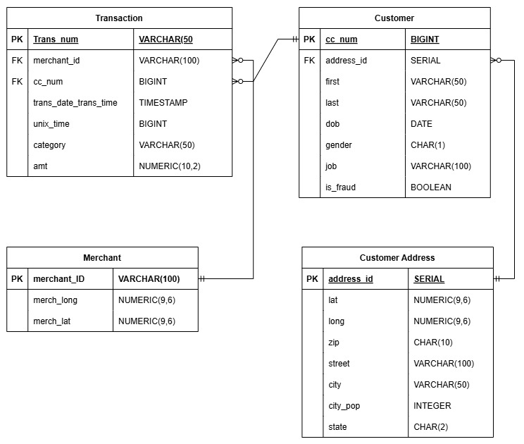
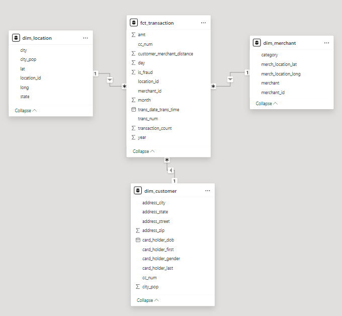
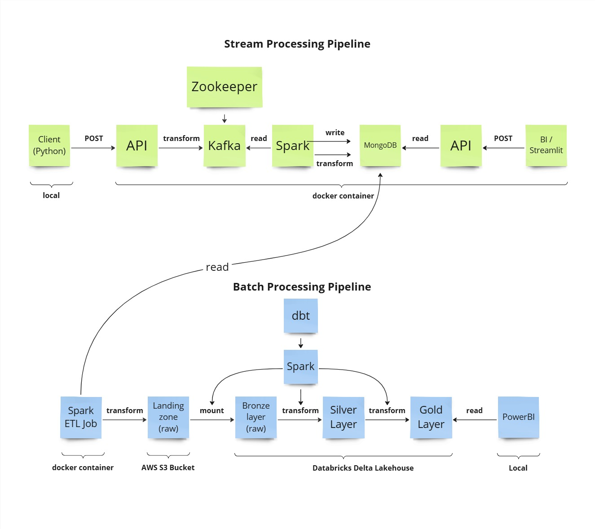

# Session 2 Notes: Data Modeling & Analytics

## Theoretical Concepts

### OLTP vs OLAP

**OLTP (Online Transaction Processing)**
- Purpose: Day-to-day operations and transaction management
- Characteristics:
  - Fast query processing for small transactions
  - Data integrity and consistency
  - Normalized schema (3NF) to reduce redundancy
  - High volume of read/write operations
  - Real-time data processing
- Example: E-commerce order entry system, banking transaction system
- refs: https://leapcell.io/blog/blueprint-for-digital-commerce-a-relational-database-design

**OLAP (Online Analytical Processing)**
- Purpose: Data analysis, reporting, and decision making
- Characteristics:
  - Complex queries with aggregations
  - Historical data analysis
  - Denormalized schema (Star/Snowflake) for query performance
  - High volume of read operations, low write volume
  - Batch processing
- Example: Sales reporting, trend analysis, BI dashboards

### Entity Relationship (ER) Model

**First Principles**
- ER model conceptualizes data as entities and relationships
- Entities represent real-world objects (Customer, Product, Transaction)
- Attributes describe entities (Customer Name, Product Price)
- Relationships define how entities interact (Customer makes Transaction)
- refs: 
  - https://www.red-gate.com/blog/how-to-use-er-diagram
  - https://medium.com/@Samietex/how-to-design-a-database-in-3-easy-steps-conceptual-logical-and-physical-modeling-3bd2a789de04

**Key Components**
- Entity: Distinct object/concept
- Attribute: Property of an entity
- Primary Key: Unique identifier for entity
- Foreign Key: References primary key of related entity
- Cardinality: Number of relationships (1:1, 1:N, N:N)
- refs: https://www.youtube.com/watch?v=8fF7Rcfcy2A

**3NF (Third Normal Form)**
- Ensures data integrity and reduces redundancy
- Rules:
  1. 1NF: All values atomic, no repeating groups
  2. 2NF: No partial dependencies (all non-key attributes depend on entire primary key)
  3. 3NF: No transitive dependencies (non-key attributes don't depend on other non-key attributes)
- refs: 
  - https://medium.com/@ajadiololade/understanding-database-normalization-a-practical-guide-with-e-commerce-examples-02c87b234a49
  - https://www.freecodecamp.org/news/database-normalization-1nf-2nf-3nf-table-examples/

### Star Schema

**First Principles**
- Star schema optimizes query performance for analytical workloads
- Denormalized design reduces join operations
- Simpler to understand and maintain for business users
- refs:
  - https://medium.com/@manojt2501/a-step-by-step-approach-to-convert-er-models-to-effective-dimensional-models-3a21ec02e8e
  - https://medium.com/@sarahryliegasparini/your-conceptual-guide-to-building-a-star-schema-data-warehouse-3ea25ccf0fce
  - https://www.youtube.com/watch?v=mPnnygpy2lY

**Components**
- **Fact Table**: Central table containing quantitative measures
  - Contains foreign keys to dimension tables
  - Stores numeric measures (sales, quantity, revenue)
  - [High cardinality](https://www.tigerdata.com/blog/what-is-high-cardinality)
  - [Grain](https://www.ibm.com/docs/en/ida/9.1.1?topic=phase-step-identify-grain): One row per unit of analysis (e.g., daily sales by product and country)

- **Dimension Tables**: Descriptive context
  - Low cardinality, wide tables
  - Contains descriptive attributes
  - Linked to fact table via foreign keys

**Advantages**
- Faster query performance (fewer joins)
- Simpler SQL queries
- Better for business user understanding
- Easier to aggregate and filter

**Trade-offs**
- Data redundancy (storage cost)
- Potential data inconsistency
- More complex ETL to maintain

### Medallion Architecture

**First Principles**
- Progressive refinement of data quality and structure
- Each layer adds value through transformation and validation
- Enables data lineage and traceability. [source](https://community.databricks.com/t5/community-articles/the-medallion-architecture-why-data-layers-matter-for-modern/td-p/140825#:~:text=The%20Bronze%20layer%20operates%20on,reprocess%20it%20correctly%20from%20scratch.)

**Layers**

**Bronze Layer (Raw)**
- Purpose: Ingestion and initial storage
- Characteristics:
  - Raw data as-is from source
  - Minimal transformation (format conversion)
  - Append-only
  - High storage cost, low quality
- Use case: Data recovery, audit trail, source for reprocessing

**Silver Layer (Intermediate)**
- Purpose: Data cleaning and standardization
- Characteristics:
  - 3NF normalized structure
  - Basic validation and cleaning
  - Deduplication
  - Standardized naming conventions
- Use case: Intermediate analysis, data quality checks

**Gold Layer (Curated)**
- Purpose: Business-ready analytics
- Characteristics:
  - Star schema (denormalized)
  - Aggregated metrics
  - Business-optimized structure
  - High data quality
  - Trend analysis indicators
  - Performance-optimized for BI queries
- Use case: BI dashboards, reporting, analytics
- Tables:
  - `fact_sales_monthly`: Monthly aggregated metrics
  - `fact_product_performance`: Product-level performance analysis
  - `fact_country_sales`: Country/regional sales analysis
  - `fact_sales_daily_enhanced`: Daily metrics with trend analysis

### Gold Layer Design Principles

**Business Metric Focus**

Gold layer tables are designed around business questions:
- **Monthly Performance**: How did we do last month?
- **Product Analysis**: Which products are performing best?
- **Regional Analysis**: Which countries generate most revenue?
- **Trend Analysis**: How are we performing over time?

**Aggregation Strategies**

1. **Temporal Aggregation**: Daily → Monthly → Quarterly → Yearly
   - Reduces data volume
   - Speeds up queries
   - Aligns with reporting periods

2. **Categorical Aggregation**: Product → Category, Country → Region
   - Enables drill-down analysis
   - Supports multiple levels of granularity

3. **Performance Metrics**:
   - SUM: Total revenue, quantity
   - AVG: Average transaction value
   - COUNT: Number of transactions, unique customers
   - MIN/MAX: First/last sale dates

**Trend Analysis**

Gold layer includes comparative metrics:
- **Period-over-Period**: Compare to previous day/week/month
- **Percentage Change**: Growth rates
- **Variance**: Deviation from average
- **Moving Averages**: Smoothed trends

**Indexing Strategy**

Gold layer indexes optimize for common BI queries:
- Date columns for time-series queries
- Metric columns for top/bottom queries
- Dimension columns for filtering
- Composite indexes for common combinations

**Data Quality Checks**

Gold layer ensures:
- Referential integrity maintained
- No negative values in metrics
- Proper handling of NULL values
- Consistent date ranges
- Accurate aggregations

### Gold Layer Tables

**fact_sales_monthly**

Aggregates daily sales to monthly level for reporting:
- Purpose: Executive dashboards, monthly reports
- Grain: One row per month
- Key metrics: Total revenue, quantity, transactions
- Derived metrics: Averages, unique counts

**fact_product_performance**

Product-level lifetime metrics:
- Purpose: Product analysis, inventory planning
- Grain: One row per product
- Key metrics: Lifetime revenue, quantity sold
- Derived metrics: Daily averages, performance indicators

**fact_country_sales**

Country/regional performance metrics:
- Purpose: Market analysis, geographical reporting
- Grain: One row per country
- Key metrics: Total revenue, quantity, transactions
- Derived metrics: Average order value, market penetration

**fact_sales_daily_enhanced**

Enhanced daily metrics with trend analysis:
- Purpose: Daily monitoring, KPI tracking
- Grain: One row per day
- Key metrics: Daily revenue, quantity, transactions
- Trend metrics: Change vs previous day, percentage change
- Flags: Weekend, holiday indicators

### BI Visualization with Apache Superset

**What is Apache Superset?**

Open-source business intelligence platform for:
- Interactive data exploration
- Rich visualizations (50+ chart types)
- Dashboard creation and sharing
- SQL Lab for custom queries
- Row-level security

**Connecting Superset to PostgreSQL**

1. Database connection using SQLAlchemy URI
2. Import schemas: silver, gold
3. Import tables from gold schema
4. Define column types and metrics
5. Create relationships between tables

**Chart Types for Analytics**

**Time Series Charts:**
- Line charts: Trends over time
- Area charts: Volume over time
- Bar charts: Period comparisons

**Comparison Charts:**
- Bar charts: Category comparison
- Pie charts: Part-to-whole
- Treemaps: Hierarchical data

**Geographical Charts:**
- World maps: Country performance
- Choropleth maps: Regional intensity

**Advanced Visualizations:**
- Heatmaps: Correlation analysis
- Pivot tables: Multi-dimensional analysis
- Box plots: Distribution analysis

**Dashboard Best Practices**

1. **KPIs at Top**: Key metrics visible first
2. **Drill-down Capability**: Click to explore details
3. **Filters**: Interactive filters for focus
4. **Consistent Colors**: Same colors for same dimensions
5. **Clear Labels**: Descriptive titles and axis labels
6. **Performance**: Optimize queries for fast loading

**Superset vs Traditional BI**

| Aspect | Superset | Traditional BI |
|--------|----------|----------------|
| Cost | Free (open-source) | Expensive licenses |
| Flexibility | Highly customizable | Limited customization |
| Integration | Easy with modern DB | Requires connectors |
| Learning Curve | Medium | High |
| Support | Community | Vendor support |

## Implementation Considerations

### Fact Table Design
- Define grain: What does one row represent?
- Include dimension keys (date, product, customer)
- Include measures (revenue, quantity, transactions)
- Add metadata (created_at, updated_at)

### Dimension Table Design
- Include natural key (source system ID)
- Include surrogate key (integer for joins)
- Include descriptive attributes
- Include slowly changing dimension (SCD) columns
- Type 1: Overwrite (current state only)
- Type 2: History (versioning with valid dates)

### Performance Optimization
- Indexes: Create on foreign keys and frequently filtered columns
- Partitioning: Partition large tables by date (range partitioning)
- Materialized views: Pre-compute expensive aggregations

### Data Quality
- Validate referential integrity
- Check for null/invalid values
- Monitor data volumes and row counts
- Implement reconciliation checks between layers
- Gold layer: Validate business logic consistency
- Gold layer: Check trend metric calculations

### Gold Layer Best Practices

**Aggregation Design**
- Choose appropriate granularity (daily, weekly, monthly)
- Store raw metrics and derived metrics
- Include time-based filters for performance
- Materialize expensive aggregations

**Performance Optimization**
- Index frequently queried columns
- Use materialized views for complex aggregations
- Partition large tables by date
- Optimize join patterns

**Business Alignment**
- Consult business users on metrics definitions
- Document metric calculations
- Provide consistent metric definitions across tables
- Include business-friendly column names

**Trend Analysis Implementation**
- Calculate period-over-period comparisons
- Handle edge cases (first day, missing data)
- Document calculation methodology
- Provide context for trend metrics
